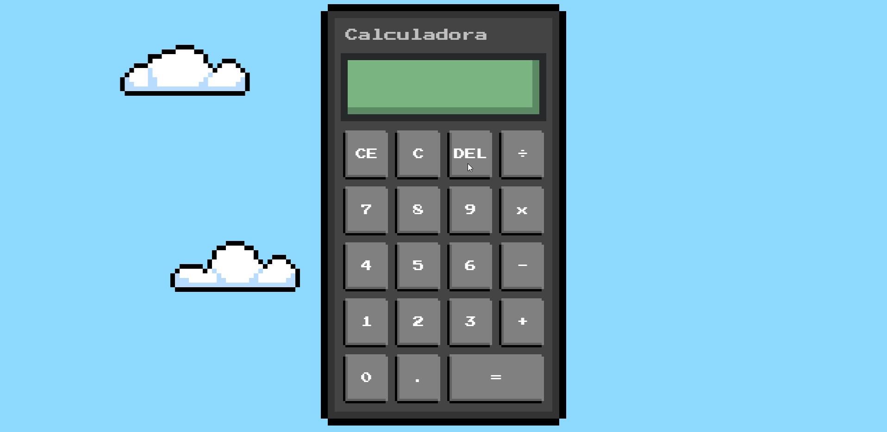

<h3 align = "center" fontSize="200px">
  Calculadora do windows Estilizada
</h3>

  

## :rocket: Tecnologias

- [Html](https://developer.mozilla.org/pt-BR/docs/Web/HTML/Element/html/)  
- [CSS](https://developer.mozilla.org/pt-BR/docs/Web/CSS)  
- [JavaScript](https://developer.mozilla.org/pt-BR/docs/Web/JavaScript) 

## 💻 Projeto

Projeto de uma calculadora feita com javascript e personalizada com css, projetada junto com o professor [ Matheus Battisti](https://github.com/matheusbattisti) do canal 
[Hora de codar](https://www.youtube.com/c/MatheusBattisti).

